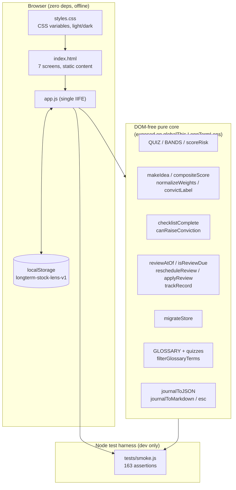

# ARCHITECTURE — Long-Term Lens

## Overview

Single-page static site. Vanilla HTML/CSS/JS, zero runtime dependencies, no build
step, no backend. All user data persists in `localStorage` under one key
(`longterm-stock-lens-v1`). Deploys to GitHub Pages from `main` as-is.

## Files

| File | Role |
|---|---|
| `index.html` | App shell. Seven screens toggled by `data-nav` buttons: `ideas` (home), `idea` (detail), `reviews`, `track` (track record), `profile` (investor quiz), `learn` (micro-lessons), `accounts`. Content sections are static HTML; dynamic regions are empty containers filled by `app.js`. |
| `styles.css` | Calm research theme via CSS custom properties (dark + light paper themes). Responsive (`auto-fit` grids, one mobile breakpoint at 640px), `prefers-reduced-motion` support, `:focus-visible` states, 44px touch targets. |
| `app.js` | All logic. IIFE; DOM-free data + pure functions (`QUIZ`, `BANDS`, `scoreRisk`, `GLOSSARY`, `compositeScore`, `migrateStore`, `applyReview`, `trackRecord`, …) are exposed on `globalThis.LongTermLens` for the Node smoke test. |
| `tests/smoke.js` | Node test: asserts pure-logic behavior, then boots the real page in jsdom, clicks through nav/quiz/idea flows, and checks `localStorage` round-trips. |

## Data flow



```
QUIZ answers (0-3 each) --scoreRisk--> { total, band } --> allocation bar UI
Idea form --makeIdea--> idea { thesis, assumptions, checklist, scores, weights }
  --compositeScore--> 0-100 composite --> sorted ideas list
  --applyReview--> reviewHistory --> trackRecord --> calibration summary
Legacy { entries } --migrateStore--> { schema: 2, ideas } (saved on first load)
```

- **Investor profile quiz:** 6 questions × 4 options. Each option scores 0–3. Total 0–18 maps to the first `BANDS` entry whose `min` is satisfied. Every band keeps broad index funds as the majority holding. The latest result persists in the store (`quizProfile`).
- **Scorecard:** three 1–5 dimensions (Quality / Value / Conviction) with user-adjustable 0–100 weights. `normalizeWeights` auto-normalizes, so 50/30/20 and 5/3/2 behave identically. `compositeScore` returns a 0–100 composite (partial scoring computes over scored dimensions only) or `null` when nothing is scored; `convictLabel` maps it to a conviction phrase (Strong conviction / Growing conviction / Watching / Early research / Unscored).
- **Pre-decision checklist gate:** five beginner-worded items (moat, earnings, debt, valuation, circle of competence). `canRaiseConviction` blocks raising conviction above "watching" until `checklistComplete` is true.
- **Reviews:** every idea has `reviewAt` (default ~90 days out). `applyReview` appends `{date, outcome, reasonMatch, note}` to `reviewHistory`, re-schedules the next review, and flips `status` to `resolved` on a resolved outcome. `trackRecord` counts outcomes and computes the "moved for my stated reason" calibration (excluding "too early to tell").
- **Migration:** `loadStore` upgrades any non-v2 store via `migrateStore` and persists the upgrade. v0.x `{entries: [...]}` become ideas: thesis/falsify preserved in the 3-field template, old 5-dim scores mapped onto the 3-dim scorecard (and kept verbatim as `legacyScores`), review dates preserved.
- **Escaping:** user-entered strings (names, tickers, tags, theses, assumptions, notes, prices) are rendered via `textContent` or the `esc()` helper — never raw `innerHTML`. (The quiz result band copy is developer-authored content.)

## Design decisions

- **No prices, no APIs, no recommendations.** Permanent compliance boundary: the app cannot fetch quotes and contains no buy/sell language. Historical examples are hard-coded prose illustrations.
- **localStorage only.** No accounts, no sync, no tracking. Journal entries include `createdAt` so future "revisit your thesis" reminders can compute age.
- **`<details>` for the glossary.** Zero JS needed for expand/collapse; accessible by default.
- **Score buttons toggle.** Clicking a selected 1–5 score clears it, so "I don't know" is expressible without a fake neutral value.

## Testing

`npm test` runs `tests/smoke.js`, which:
1. Requires `app.js` with stubbed `document`/`localStorage`/`window` globals so the IIFE's `init()` runs harmlessly, then asserts `scoreRisk` band boundaries and `compositeScore` math.
2. Boots `index.html` in jsdom, asserts no script errors, clicks every nav tab, completes the investor-profile quiz, quick-adds an idea (including an XSS-probe string), and verifies the idea detail renders it escaped and persists to `localStorage`.

jsdom is loaded from the sibling `poker-sparring` workspace install (dev-only); the shipped site has zero dependencies.
